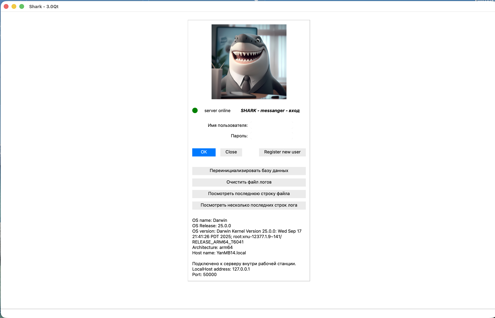
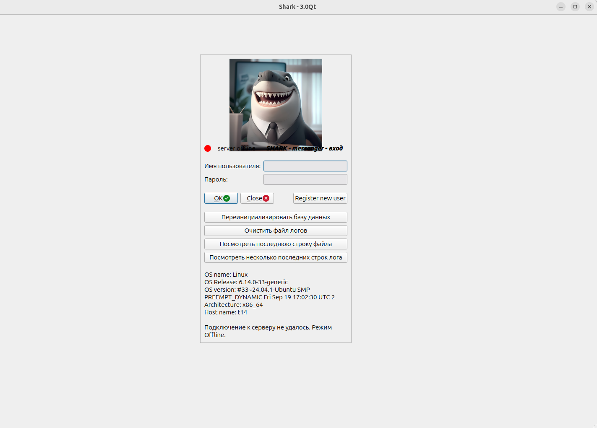
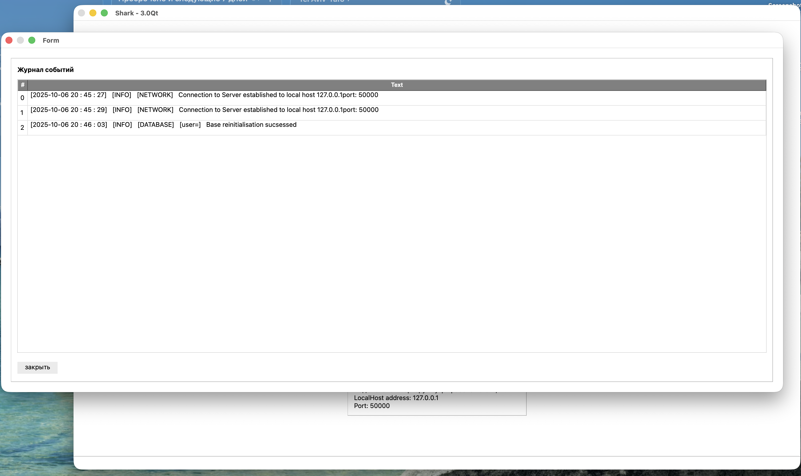
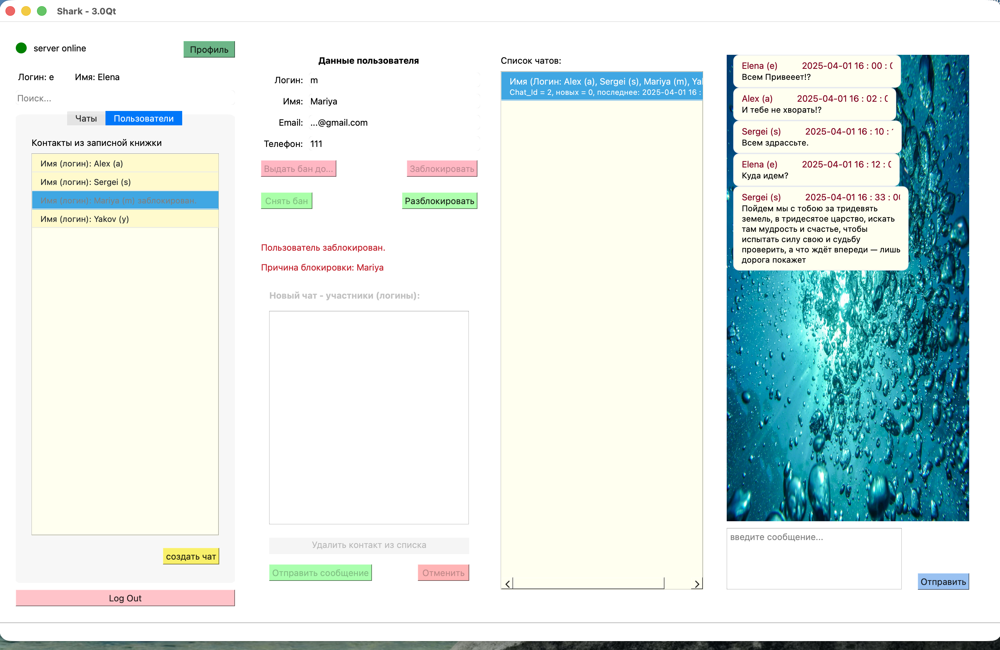
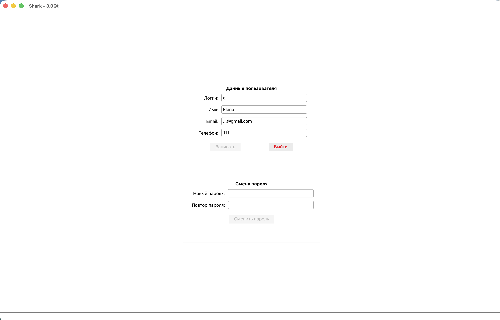

# 💬 ChatBot SHARK v 3.0 Qt 2025 made by Yan Batytskiy

**ChatBot** — это клиент-серверная TCP/UDP система чатов на C++23.
База данных - PostgreSQL
Серверная часть - с++ с возможностью работы под Mac OS и Linux.
Клиентская чать - UI на Qt c библиотекой на С++, может рабоать под Mac OS и Linux. 
Умеет искать сервер внутри рабочей станции и внутри локальной сети.
Клиентская часть имеет индикатор подключения к серверной части, а также описание системы, на которой она запущена.

Для работы используется база данных, развернутая в облаке Amazon. При необходимости можно подключить любую базу данных Postgres, указав 4 параметра в конфигурационном файле connect_db.conf
Далее необходимо из окна входа в систему подать команду переинициализации базы.

---

## 🧱 Структура проекта

```
Shark_3_0Qt/
├── CMakeLists.txt
├── connect_db.conf
├── dist/linux и macos # Сборка под Linux и Mac OS для запуска без компиляции
├── Shark_UI/ # Qt проект для Qt
├── Screens/
├── src/
│ ├── client/
│ │ └── core/
│ │ └── processors/
│ │ └── tcp_transport/
│ ├── core/
│ │ ├── chat/
│ │ ├── chat_system/
│ │ ├── exceptions_cpp/
│ │ ├── message/
│ │ ├── system/
│ │ └── user/
│ ├── dto/
│ └── server/
│ │ └── db/
│ │ └── packet_parcer/
│ │ └── processors/
│ │ └── session_transport/
│ │ └── sql_commands/
│ │ └── sql_queries/
└── README.md```

## 📦 Изменения архитектуры

1. сделан UI на базе Фреймворка Qt
2. Система обработки ошибок построена на перехвате шиной Qt обработки try/catch/throw
3. Добавлена система логирования и записи событий в файл с возможностью очистки файла логов, а также вывода на экран заданного количества последних событый
4. Клиентская часть позволяет заново пересоздавать базу данных с набором тестовых данных
5. Запущен монитор состояния подключения в отдельном потоке с передачей сигналов об изменении состояния подключения
6. Реализован поиск контактов по наличию в логине/имени заданной последовательности символов
7. Реализован просмотр данных контакта, его блокировка/разблокировка, выдача контакту бана, а также его снятие
8. Реализован механизм визуального наполнения списка участников нового чата, количество участников не ограничено
9. Реализован механизм фильтрации и отображения существующих чатов с выбранным контактом.
10. В учебных целях работа с разными списками реализована с применением разных технологий 
    - отрисовка через paint с цветовой схемой
    - использование стандартных методов отображения спискоа
11. Программа позволяет регистрировать новых пользователей, а также менять данные профиля текущего пользователя, кроме логина.
12. Работа с postgreSQL построена через механизм транзакций с подтверждением клиентской части успешности выполнения
13. Информация между клиентской и серверной частями передается с использованием структур DTO с обеих сторон, которые сериализуются/десериализуются в бинарный поток.
14. Сделан глубокий рефакторинг обеих частей системы. 

## 📦 Иллюстрации


\






---

## ⚙️ Требования

- C++20-совместимый компилятор (`g++`, `clang++`, `MSVC`)
- `CMake` версии **3.16+**
- (рекомендуется) `clangd` для автодополнения и анализа

---

## 🛠️ Сборка и запуск

### 🔧 1. Конфигурация проекта

### 📂 Скрипты

### 🧪 2. Сборка
```bash
cmake --build build
```

### 🚀 3. Запуск
```bash
# Для macOS
./dist/macos/client/MacOS/Shark_UI
./dist/macos/server/server

# Для Linux
./dist/linux/client/Shark_UI
./dist/linux/server/server

```
## 📚 Лицензия

MIT License
